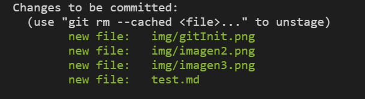
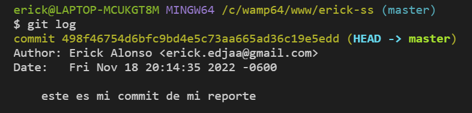
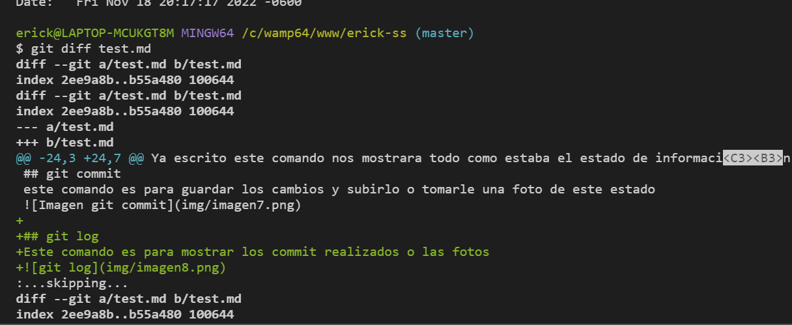

# Test de Comandos Basicos de git

## git init
Este es el comando inicial y el mas **importante** para crear un nuevo repositorio local

## git status
Este comando nos ayuda a saber el estado de la información de la rama actual

## git add
Este comando es para incluir los archivos en el espacio de trabajo

ya realizado este comando escribrimos **git status** para ver el estado

## git reset
Este comando es para resetear el estado de información

Ya escrito este comando nos mostrara todo como estaba el estado de información

## git commit 
este comando es para guardar los cambios y subirlo o tomarle una foto de este estado

## git log
Este comando es para mostrar los commit realizados o las fotos

## git diff
Este comando es para mostrar los cambios o los conflitos en esta rama

Cambios del estado del archivo

## git branch
El comando **git branch** es crear y listar ramas paralelas 
